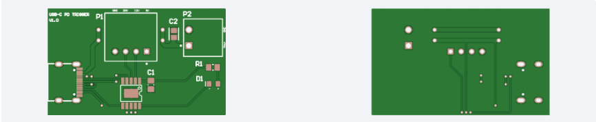
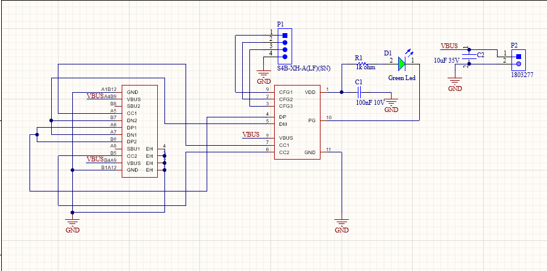

# USB-C PD / PPS Power Trigger Module (Hardware Design)

A compact, highly reliable USB-C Power Delivery (PD) and Programmable Power Supply (PPS) hardware trigger module designed in Altium Designer. 

This board negotiates with USB-C PD power supplies to output selectable DC voltages directly through screw terminals, ideal for bench supplies, DIY electronics, and robotics.

---

## Hardware Overview

---

## Key Specifications
- **Input Interface:** USB Type-C (PD 3.0 / PPS compliant)
- **Output Interface:** Screw Terminal Block (VBUS & GND)
- **Supported Voltage Profiles:** 5V, 9V, 12V, 15V, 20V (or PPS dynamic adjustment)
- **Board Dimensions:** 42.29 mm x 25.53 mm (Compact 2-layer FR-4)
- **Design Tool:** Altium Designer (Production-verified DRC & Gerber outputs)

---

## Schematic Preview

---

## Production & Design Files Package

Looking to integrate this power module into your own designs or manufacture it immediately?

The complete production-ready engineering package is available for purchase:

### [👉 Get Full Altium Design Files & Production Gerbers on Gumroad](BURAYA_GUMROAD_LINKI_GELECEK)

**What is included in the download package:**
- Complete Altium Designer Project (`.PrjPcb`, `.SchDoc`, `.PcbDoc`, Footprints & Symbols)
- Factory-verified Gerber & NC Drill (Inches 2:5 format, G85 slot command enabled)
- Complete Bill of Materials (BOM) with manufacturer part numbers
- 3D STEP mechanical model for custom enclosure designs
- High-resolution Schematic & Documentation PDF

---

## License
The documentation and hardware architecture hosted in this repository are for informational purposes. The complete manufacturing and design package is sold under a Single-Project Commercial / Personal License.
